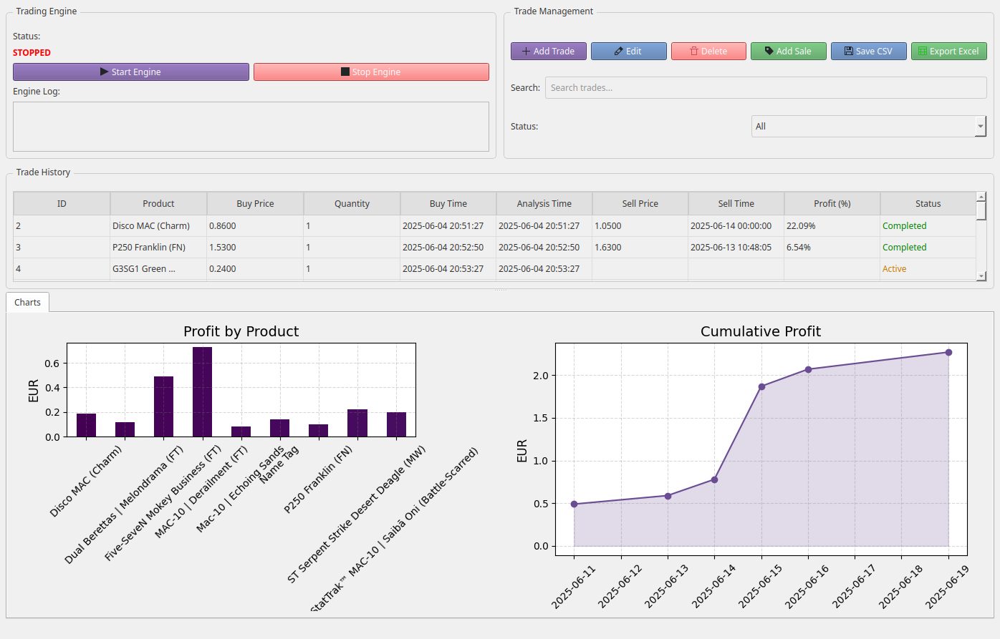
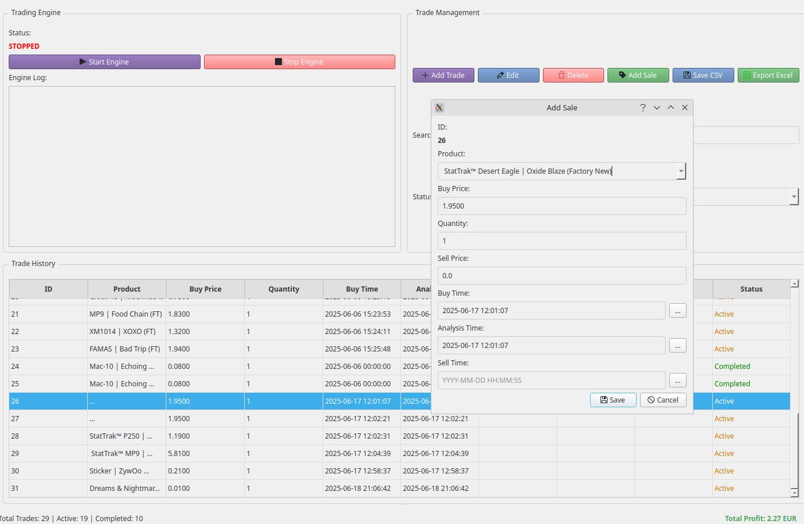

# Skins Trading Bot - Enhanced README

### Important Disclaimer

This software is provided for educational purposes only. The developers assume no responsibility for:
- Any financial losses incurred through use of this bot
- Violations of marketplace Terms of Service
- Account bans or trade restrictions imposed by any platform
- Any legal consequences of automated trading

Users are solely responsible for ensuring their compliance with all platform rules and applicable laws. Virtual item trading carries inherent risks.
## Overview
### This trading bot analyzes and trades CS:GO skins across multiple marketplaces, featuring both a powerful backend engine and a user-friendly PyQt-based UI with advanced visualization capabilities.
Main dashboard with market overview

Add Sale Function


# Key Features
## Core Functionality

- Multi-market data collection from Skinport, LIS Skins, and more (additional markets in development)

- Real-time arbitrage opportunity detection

- Historical price tracking and analysis

## Advanced UI Features

**Interactive dashboards with PyQt charts showing:**

- Profit trends over time

- Market price comparisons

- Portfolio performance

**Trade management interface:**

- Manual trade entry and editing

- Status tracking (Active/Completed)

- Profit/loss calculations

**Data visualization:**

- Interactive price history graphs

- Market spread heatmaps

- Performance metrics

# Trading Journal & Analysis

The bot maintains a comprehensive trading journal (`trading_journal.csv`) with detailed records of all transactions.

## Transaction History

| ID | Product                        | Buy Price | Quantity | Buy Time            | Sell Price | Sell Time           | Profit (%) | Status    |
|----|---------------------------------|-----------|----------|---------------------|------------|---------------------|------------|-----------|
| 2  | Disco MAC (Charm)               | 0.86      | 1        | 2025-06-04 20:51:27 | 1.05       | 2025-06-14          | 22.09%     | Completed |
| 3  | P250 Franklin (FN)              | 1.53      | 1        | 2025-06-04 20:52:50 | 1.63       | 2025-06-13          | 6.54%      | Completed |
| 14 | Five-SeveN Mokey Business (FT)  | 2.30      | 1        | 2025-06-05 00:47:19 | 2.79       | 2025-06-11          | 21.30%     | Completed |

## Recent Performance Highlights

### Top Performers:
- **Mac-10 Echoing Sands**: 50% profit (0.08 → 0.12)
- **MAC-10 Derailment (FT)**: 27.14% profit (2.69 → 3.42)
- **Disco MAC (Charm)**: 22.09% profit (0.86 → 1.05)

### Active Positions:
- StatTrak™ MP9 Ruby Poison Dart (FN) - Bought at 5.81
- StatTrak™ Desert Eagle Oxide Blaze (FN) - Bought at 1.95
- FAMAS Bad Trip (FT) - Bought at 1.94

## Roadmap & Upcoming Features

### Market Expansion:
- Integration with Buff163, CSGOFloat, and SkinBaron
- Steam Community Market support

### UI Enhancements:
- Mobile-responsive web dashboard
- Advanced filtering for trade opportunities
- Custom alert system

### Advanced Features:
- Automated trade execution
- Machine learning price prediction
- Portfolio risk analysis
# Getting Started
## Installation
```bash
git clone https://github.com/yourrepo/skins-trading-bot.git
cd skins-trading-bot
pip install -r requirements.txt
```
## Running the Application
```bash
python main.py
```

# Price Formation Analysis and HTML Visualization

# This section explains how item prices are determined across different markets and how we visualize this data in our HTML reports.
---

## Skinport Market Pricing
```json

{
  "market_hash_name": "10 Year Birthday Sticker Capsule",
  "suggested_price": 0.88,
  "min_price": 0.83,
  "max_price": 4.05,
  "mean_price": 1.55,
  "median_price": 1.13,
  "quantity": 211
}
```
-    **Suggested Price:** Algorithmically determined reference price

-    **Min/Max Price:** Current listing extremes

-    **Mean/Median:** Market price distribution indicators

-    **Quantity:** Available items affecting liquidity
---

## LIS Skins Pricing
```json

{
  "name": "USP-S | Ticket to Hell (Factory New)",
  "price": 1.76,
  "item_float": "0.057116512209177",
  "stickers": [...]
}
```
-    **Base Price:** Condition-dependent (Factory New, Field-Tested etc.)

-    **Float Value:** Additional wear-based pricing (lower = better)

-    **Stickers:** Can significantly increase value (especially rare/tournament stickers)

# Price Comparison Metrics

- analysis generates several key metrics:
```text

Data columns:
1. name                 - Item name
2. ls_min_price         - LIS Skins lowest price
3. ls_median_price      - LIS Skins median price  
4. ls_quantity          - LIS Skins available stock
5. sp_min_price         - Skinport lowest price
6. sp_suggested_price   - Skinport algorithm price
7. sp_quantity          - Skinport available stock
8. price_diff           - Absolute price difference (sp_min - ls_min)
9. price_ratio          - Relative price ratio (sp_min/ls_min)
```

# HTML Visualization

## Here's an HTML report structure showing our price analysis:


## Key Visualization Features

-    **Side-by-Side Market Comparison**

- Clear presentation of prices from both markets

- Highlighting of key differentiators (float value, stickers)

    **Arbitrage Opportunity Calculator**

- Instant visibility of profit potential

- Color-coded based on opportunity size

    **Historical Price Charts**

- Interactive time-series graphs

- Support for multiple price metrics (min, max, median)

    **Condition Indicators**

- Visual representation of wear quality

- Sticker impact visualization

    **Mobile-Responsive Design**

- Adapts to different screen sizes

- Touch-friendly interactive elements

## The HTML reports are generated automatically after each market scan, providing traders with up-to-date visual analysis of market conditions and trading opportunities.

# First-Time Setup

  -  Configure API keys in config.yaml

  -  Set your preferred markets and thresholds

  -  Customize UI preferences in config.yaml under ui_settings

## Support

For issues or feature requests, please open an issue on our GitHub repository.


